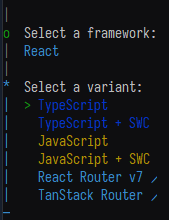
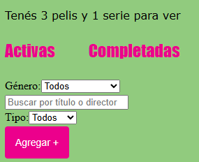
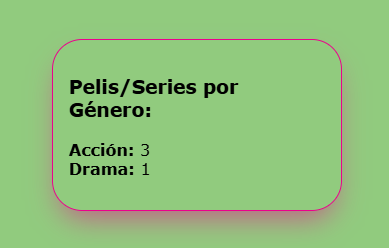
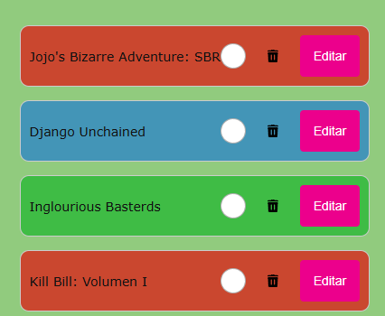
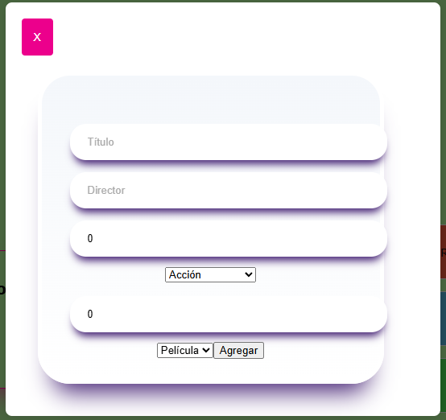

# Trabajo Práctico - PWA 2025

## Creación del Proyecto:

1. ```npm create vite@latest primer-tp -- --template react```
2. Seleccionar el framework de React (con las flechitas) y luego Enter
3. Seleccionar Typescript

    

4. Seguir las instrucciones que aparecen en la terminal.
    - cd primer-tp
    - npm install
    - npm run dev

5. Copiar la URL que aparecerá en la terminal y pegarla en el browser.

### Para añadir el Linter

1. En tu Visual Studio Code, recomiendo primero descargar ESLint
2. En la misma carpeta del proyecto, agregá ```npx eslint --init``` en la terminal
3. Te aparecerán una serie de opciones. Estas son las que tenes que seleccionar:
    ```php
    1. Primero 'y'
    2. Luego elegí Javascript
    3. Después: > To check syntax and find problems
    4. Seguí elegidiendo > Javascript modules (después de elegir en la terminal aparecerá como '.esm')
    5. Elegí > React
    6. Usaremos TypeScript? > yes
    7. Dónde corremos el código? > browser
    8. En esta parte: 'eslint, @eslint/js, globals, typescript-eslint, eslint-plugin-react' seleccionamos > yes
    9. > npm
    10. Podes empezar a codear en VSCode!
    ```
## Descripción del Trabajo

El dominio es una aplicación Watchlist personalizada en donde tenemos que:
- Colocar el contenido que querramos ver
- Almacenar el contenido visto en otra lista
- Distinguir entre película y serie. Contar cada una de ellas
- Filtrar por género, título y nombre del director
- Ordenar numéricamente por año y rating _(En progreso)_
- Editar los datos del contenido
- Borrar y limpiar las listas _(La confirmación está en progreso)_

### Un poco de imágenes del dominio:










### Detalles a tener en cuenta:
- Aclarar que faltan algunos estilos en diferentes partes, está en un punto de _Work in Progress_
- No es responsive :/
- Podés salir de la ventana modal clickeando en el botón X, afuera o incluso con la tecla **Escape**
- Faltan datos por validar
- No soy bueno con el diseño

### Recursos:
- [Documentación React](https://es.react.dev/learn)
- [Documentación TypeScript](https://www.typescriptlang.org/docs/)
- [Curso React de Midudev](https://www.youtube.com/watch?v=7iobxzd_2wY&list=PLUofhDIg_38q4D0xNWp7FEHOTcZhjWJ29)
- [Curso React de Sergie Code](https://www.youtube.com/watch?v=ladwC6Lrs-M&t=4212s)
- [Curso TypeScript de Sergie Code](https://www.youtube.com/watch?v=UTA5bykCx2c&t=3385s)